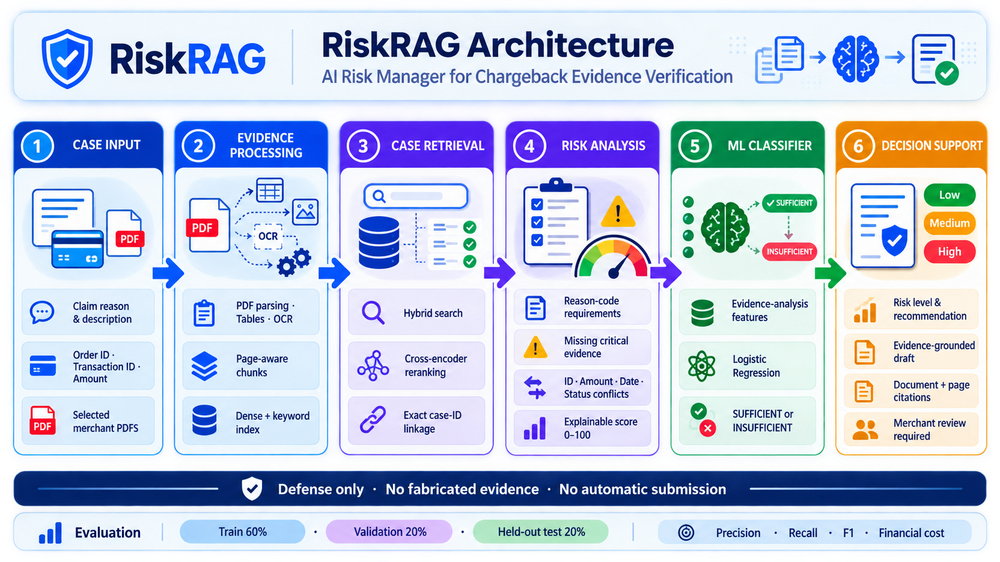

# RiskRAG — AI Risk Manager for Chargeback Loss

RiskRAG helps merchants stop avoidable chargeback losses by finding case evidence, checking it against the selected reason code, detecting gaps and contradictions, estimating whether the evidence package is sufficient, and preparing a source-grounded draft response for merchant review.

It addresses **one class of loss: chargebacks**. It does not score returns, originate payments, decide whether a cardholder committed fraud, or submit disputes.

## Why this fits the AI Risk Manager track

- **Working detector:** flags identifier, amount, date, delivery-status, refund-status, and cross-document conflicts.
- **Working verifier:** maps a chargeback reason to its evidence requirements and identifies missing and critical evidence.
- **Working responder:** produces a draft composed only from retrieved merchant evidence with page-level citations.
- **Measured ML:** classifies `SUFFICIENT_EVIDENCE` versus `INSUFFICIENT_EVIDENCE`; Logistic Regression, Random Forest, and XGBoost are compared on validation data before one held-out test evaluation.
- **Honest loss metrics:** reports precision, recall, F1, accuracy, confusion matrix, false-positive and false-negative rates, and configurable FP/FN financial cost.
- **Defense only:** no evidence fabrication, payment-system access, fraud enablement, or automatic chargeback submission. Merchant review is always required.

## Merchant workflow

1. Upload the PDFs belonging to a chargeback case.
2. Select only the documents for that case.
3. Choose the card network and reason code.
4. Enter claim description, order ID, transaction ID, and disputed amount. Dates and claimed delivery/refund status are optional.
5. Run the assessment.
6. Review the evidence score, risk level, recommendation, ML result, requirements, missing documents, contradictions, cited excerpts, and draft.
7. Open citations to verify the exact source page and region.
8. Resolve every gap and contradiction before manually using the response in the merchant's approved dispute process.

`AUTO_RESPOND` means only that a draft is ready for merchant review. RiskRAG never submits it.

## System architecture


- **Evidence ingestion:** Docling extracts document layout, tables, figures, and OCR text while retaining page and bounding-box metadata.
- **Evidence indexing:** Chroma stores dense vectors; SQLite FTS5 provides keyword search and metadata.
- **Evidence retrieval:** query decomposition, dense and BM25 retrieval, reciprocal-rank fusion, reference expansion, and cross-encoder reranking locate case-relevant passages.
- **Requirements engine:** `backend/data/chargeback-reason-codes.csv` maps the selected claim type to required evidence.
- **Verifier:** case-linked passages are checked for requirement support and contradictions.
- **Risk scoring:** an explainable 0–100 score combines coverage, critical requirements, identifier coverage, and contradiction penalties.
- **Classifier:** the selected model predicts evidence sufficiency from verifier features.
- **Draft responder:** usable passages are quoted with document, chunk, page, and region references. No unsupported factual text is generated.
- **Review interface:** the React application presents the complete chargeback workflow and opens the cited PDF region.

Key files:

- `backend/app/api/routes_risk.py` — chargeback reason-code and analysis API.
- `backend/app/services/risk_service.py` — evidence requirements, extraction, contradiction checks, scoring, recommendations, and grounded drafting.
- `backend/app/services/risk_model.py` — selected-model inference.
- `backend/eval/run_eval.py` — the single chargeback evaluation entry point.
- `backend/ml/train.py` — reproducible synthetic-case generation, model comparison, held-out evaluation, costs, and reports.
- `frontend/src/components/RiskPanel.tsx` — merchant chargeback review workflow.

## Chargeback reference data

`backend/data/chargeback-reason-codes.csv` has 64 rows for Visa, Mastercard, American Express, and Discover. Its schema is:

`network`, `code`, `title`, `plain_english_meaning`, `response_deadline`, `key_evidence`, `winnability_label`, `source`.

RiskRAG uses `network`, `code`/`title`, and `key_evidence` as local guidance. Semicolon-separated `key_evidence` values become review requirements. The first listed requirement is treated as critical by application policy. A transaction record containing matching order ID, transaction ID, and amount is also critical.

The CSV does **not** contain labeled merchant cases. `winnability_label` is guidance attached to a reason code; it is not an observed outcome, ML label, win probability, or evidence. CSV text is never treated as merchant evidence. Networks and processors can change rules and deadlines, so the merchant must confirm current requirements.

## Evidence checks

A retrieved passage is linked to a case only when it comes from a selected document and contains the exact labeled order ID or transaction ID. Entirely unlinked passages are excluded. A passage linked by one correct ID but containing a different second ID is flagged.

Supported explicit fields include:

- `Order ID` and `Transaction ID`
- `Amount` or `Total`
- `Transaction date`, `Delivery date`, and `Refund date` in `YYYY-MM-DD`
- `Delivery status`
- `Refund status`

RiskRAG detects mismatched IDs and amounts, inconsistent transaction dates, delivery after an expected date, delivery/refund before the transaction, invalid dates, delivery/refund status conflicts with the claim, and disagreements between sources. When sources disagree, both sides are excluded from requirement matching and drafting.

A requirement receives a **candidate evidence match** when an affirmative local sentence has sufficient meaningful-token overlap. Sentences describing missing, pending, hypothetical, template, or required-but-absent evidence do not count. Candidate matching does not establish authenticity; every excerpt must be inspected by the merchant.

## Explainable score and action policy

Score:

```text
round(70 × requirement coverage
    + 20 × all-critical-requirements-present
    + 10 × identifier coverage)
- 25 × detected contradictions
```

The result is clamped to 0–100. No linked evidence produces zero.

Recommendation priority:

1. A contradiction produces `MANUAL_REVIEW`.
2. Missing critical evidence or no linked evidence produces `GATHER_MORE_EVIDENCE`.
3. Score ≥ 85, every requirement present, both identifiers present, and an ML result of `SUFFICIENT_EVIDENCE` produces `AUTO_RESPOND`.
4. Every other case produces `MANUAL_REVIEW`.

Risk is HIGH when contradictions exist or score is below 50, LOW only when a draft is ready for review, and MEDIUM otherwise. This measures evidence readiness, not fraud probability or legal outcome.

## ML methodology — synthetic demonstration

Because the supplied reference has no labeled cases, `backend/ml/synthetic_demonstration.csv` contains 2,400 explicitly marked synthetic **feature-level** cases. It does not contain fake documents or real merchant records.

Features are produced by the evidence analysis contract:

- requirement coverage
- critical-requirement coverage
- linked-passage count
- ID-conflict count
- amount-conflict count
- date-conflict count
- status-conflict count
- identifier coverage

Labels are generated from latent completeness, critical-document availability, identity, conflict, and authenticity variables. Noise simulates extraction failures and missed conflicts. Authenticity is deliberately unobservable, preventing a perfect synthetic result. The label is not copied from the final score formula.

Seed **42** creates fixed stratified splits:

- Train: 1,440 cases
- Validation: 480 cases
- Held-out test: 480 cases

Candidate models:

- Logistic Regression, maximum 1,000 iterations
- Random Forest, 100 trees, depth 6, minimum leaf size 5
- XGBoost, 100 trees, depth 3, learning rate 0.05

Each candidate is trained only on the train split. Thresholds 0.35, 0.50, 0.65, and 0.80 are compared on validation. Selection maximizes validation F1, then precision, then recall, with deterministic tie-breaking. The selected train-fitted model and threshold are frozen. The held-out test is then evaluated once; it is not used for tuning or refitting.

## Actual evaluation results

Validation selected **Logistic Regression at threshold 0.50**:

- Logistic Regression: F1 **90.68%**, precision **91.45%**, recall **89.92%**
- Random Forest: F1 **89.45%**, precision **89.83%**, recall **89.08%**
- XGBoost: F1 **89.92%**, precision **89.92%**, recall **89.92%**

Held-out synthetic test results:

- Precision: **88.70%**
- Recall: **86.44%**
- F1: **87.55%**
- Accuracy: **93.96%**
- Confusion matrix: TN **349**, FP **13**, FN **16**, TP **102**
- False-positive rate: **3.59%**
- False-negative rate: **13.56%**
- Default FP cost: **100 units**
- Default FN cost: **25 units**
- Total error cost: **1,700 units**
- Cost per test case: **3.54 units**

A false positive means insufficient evidence was predicted sufficient, so it receives the higher default cost. A false negative means sufficient evidence was predicted insufficient. Costs are illustrative user-defined units and do not represent expected chargeback values.

The metrics evaluate the classifier, not the full recommendation policy. Rule-based review gates can further restrict `AUTO_RESPOND`.

Machine-readable and human-readable reports:

- `backend/ml/evaluation_report.json`
- `backend/ml/evaluation_report.md`

The reports also include every validation threshold result, split class counts, metric definitions, feature names, dataset SHA256, cost assumptions, and library versions.

## Setup

Requirements:

- Python 3.11+
- Node.js 22.12+
- Sufficient disk and memory for PDF, embedding, and reranking models
- Network access during first dependency/model installation

Backend, from the repository root:

```powershell
cd backend
python -m venv .venv
.\.venv\Scripts\python.exe -m pip install -e ".[dev]"
Copy-Item .env.example .env
.\.venv\Scripts\python.exe -m uvicorn app.main:app --host 127.0.0.1 --port 8000
```

Frontend, in another terminal:

```powershell
cd frontend
npm ci
npm run dev
```

Open `http://localhost:5173`. API documentation is at `http://localhost:8000/docs`.

Optional provider keys in `backend/.env` support query decomposition and evidence retrieval assistance. The chargeback risk draft itself is extractive and does not require an LLM key. Never put credentials in frontend code or merchant evidence files.

Docker:

```powershell
Copy-Item backend/.env.example backend/.env
docker compose up --build
```

## Reproduce metrics and run tests

```powershell
cd backend
.\.venv\Scripts\python.exe -m pip install -r ml/requirements-reproduce.txt
.\.venv\Scripts\python.exe -m eval.run_eval --fp-cost 100 --fn-cost 25
.\.venv\Scripts\python.exe -m pytest
```

```powershell
cd frontend
npm test
npm run build
```

Verification completed for this implementation:

- Backend: **61 passed**, including end-to-end PDF ingestion, retrieval, and citation tests
- Frontend: **18 passed**
- Frontend production build: passed
- RiskRAG backend lint checks: passed

## API

`GET /api/risk/reason-codes` returns supported network/reason-code guidance.

`POST /api/risk/analyze` accepts:

```json
{
  "network": "Visa",
  "claim_type": "13.1",
  "description": "Cardholder reports that the goods were not received.",
  "order_id": "ORDER-123",
  "transaction_id": "TXN-456",
  "amount": "50.00",
  "document_ids": ["selected-document-id"],
  "transaction_date": null,
  "expected_delivery_date": null,
  "claimed_delivery_status": "not_delivered",
  "claimed_refund_status": "unknown"
}
```

The response includes reference guidance, requirements, candidate evidence, missing and critical evidence, extracted fields, contradictions, analysis features, score explanation, ML prediction, risk, recommendation, grounded draft, citations, and `merchant_review_required: true`.

## Defense-only safety

RiskRAG cannot create, alter, or authenticate evidence. It never invents missing facts. It cannot access payment rails or submit a chargeback response. It does not label a cardholder as fraudulent or make legal decisions. Contradictions trigger review; missing critical records trigger evidence gathering; every draft is explicitly marked for merchant approval.

Do not use RiskRAG to fabricate documents, misrepresent a transaction, accuse a customer, evade financial controls, or automate an adverse decision. Use access control, tenant isolation, encryption, retention policies, audit logs, and independently labeled evaluations before production deployment with sensitive merchant data.

## Limitations

- Published metrics are from synthetic feature-level cases and do not establish real-world performance.
- Evidence matching can miss paraphrases, fields spread across chunks, unlabeled tables, handwriting, non-Latin text, skewed scans, and image details not captured by OCR.
- A candidate match or high score does not prove authenticity, admissibility, rule compliance, or dispute success.
- Multi-currency amounts, partial refunds, split shipments, subscriptions, and multi-item orders need manual reconciliation.
- Document selection limits search scope but is not a tenant authorization system.
- Network requirements and deadlines must be verified with the merchant's current processor documentation.
