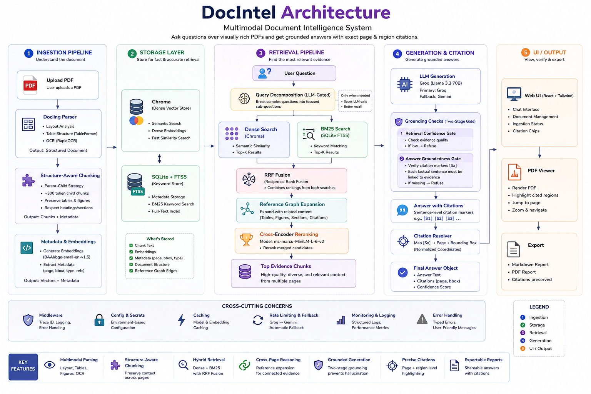

# DocIntel — Multimodal Document Intelligence

Ask questions over a collection of visually rich PDFs (multi-column layouts, figures, tables,
scans) and get answers that draw on information spread across several pages, with every part of
the answer linked back to the exact page and region it came from.

See **[ADR.md](ADR.md)** for the full design doc and the reasoning behind every non-obvious
choice — this README is setup/run instructions.

## Architecture in one paragraph



PDFs are parsed with [Docling](https://github.com/docling-project/docling) (layout model +
table-structure model + OCR fallback for scans), chunked with a structure-aware parent/child
strategy that never splits a table and keeps section context spanning pages, and indexed into
both a dense vector store (Chroma) and a keyword index (SQLite FTS5/BM25). A question is answered
by: optionally decomposing it into sub-questions (LLM-gated), hybrid dense+BM25 search fused with
Reciprocal Rank Fusion, reference-graph expansion ("see Table 2" → pull in Table 2), cross-encoder
reranking over the merged candidate pool, then grounded generation (Groq/Llama, with automatic
fallback to Gemini if Groq's free-tier quota is hit) with per-sentence `[Sn]` citation markers and
a two-stage groundedness gate that refuses rather than guesses. The React frontend renders the
source PDF page and highlights the exact cited region, and any answer can be exported as a
Markdown or PDF report with citations linked back to source pages.

## Prerequisites

- Python 3.11+
- Node.js 18+
- Free API keys (no credit card): [Groq](https://console.groq.com/keys) and
  [Google AI Studio](https://aistudio.google.com/apikey)

> **Free-tier quota note:** Groq's free tier is 100k tokens/day, shared across every request that
> hits your key (manual use + eval runs). If you see `429` / rate-limit errors, the app
> automatically falls back to Gemini for generation (`app/llm/fallback_client.py`) - no action
> needed, just slightly different phrasing in answers. If you exhaust *both* keys, wait for the
> daily reset or add a third provider (e.g. [NVIDIA NIM](https://build.nvidia.com), free tier,
> OpenAI-compatible API - implementing a client for it is a ~30-line addition to `app/llm/`,
> since every provider just implements the two-method `LLMClient` protocol in `app/llm/base.py`).

## Quick start (no Docker)

```bash
# 1. Backend
cd backend
python -m venv .venv
./.venv/Scripts/python -m pip install -e ".[dev]"   # Windows; use ./.venv/bin/python on macOS/Linux
cp .env.example .env                                 # then fill in GROQ_API_KEY / GEMINI_API_KEY
./.venv/Scripts/python -m uvicorn app.main:app --port 8000

# 2. Frontend (separate terminal)
cd frontend
npm install
cp .env.example .env      # default already points at localhost:8000
npm run dev
```

Open `http://localhost:5173`, upload a PDF from `corpus/`, wait for it to finish parsing (status
badge flips to "Ready"), and ask a question. Click any citation chip to jump to and highlight the
source region; use "Export Markdown" / "Export PDF" under an answer to save it, citations and all,
as a standalone report you can share or attach elsewhere.

> **Windows note:** Docling's layout model attempts `torch.compile` on first run, which needs an
> MSVC C++ toolchain most dev machines don't have. `TORCHDYNAMO_DISABLE=1` is already set inside
> `app/data/parsing/docling_parser.py` and `app/main.py`, so this is handled for you — mentioned
> here only so it's not a mystery if you see it in logs.

## Quick start (Docker Compose)

```bash
cp backend/.env.example backend/.env   # fill in GROQ_API_KEY / GEMINI_API_KEY
docker compose up --build
```

Backend on `http://localhost:8000`, frontend on `http://localhost:5173`. Ingested documents
persist in a named volume (`docintel_storage`) across restarts.

## Running the tests

```bash
cd backend
./.venv/Scripts/python -m pytest
```

47 tests, one command, no API keys required (the integration test fakes the LLM call so it's
fully reproducible offline — see `tests/integration/test_ingest_query_e2e.py`). The integration
test does load the real Docling/embedding/reranker models, so the first run takes ~1-2 minutes;
subsequent runs are faster once models are cached locally by `sentence-transformers`/`docling`.

Run just the fast unit tests: `pytest tests/unit`.

## Running the frontend tests

```bash
cd frontend
npm test
```

15 frontend tests covering the API client and AnswerMessage component (citation chips, groundedness
bar, export buttons, row citations). No backend required.

## Running the evaluation

```bash
cd backend
./.venv/Scripts/python -m eval.run_eval
```

One command. It ingests `corpus/*.pdf` into a dedicated index (idempotent — skips files already
ingested, so re-runs after the first are fast), runs the 27-question gold set
(`backend/eval/gold_set.yaml`) through three retrieval configurations (naive dense-only baseline,
hybrid+rerank, full pipeline), generates answers, and scores faithfulness/relevance with an
independent Gemini judge. Writes `backend/eval/results.json` (machine-readable) and
`backend/eval/report.md` (the human-readable results report — retrieval metrics, groundedness,
refusal correctness, a "what the numbers changed" writeup, and a failure-case section).

Useful flags:
- `--limit 5` — fast smoke run over the first 5 gold questions
- `--skip-judge` — skip the Gemini LLM-judge pass (no `GEMINI_API_KEY` needed)
- `--top-k 5` — retrieved-set size for Hit@k / page-recall (default 5)

## Repo layout

```
backend/
  app/
    api/         FastAPI routes, Pydantic request/response contracts, trace-id middleware
    services/    ingestion, chunking, generation, citation, export (Markdown/PDF) - business logic
    retrieval/   hybrid search, RRF fusion, reranking, query decomposition, graph expansion
    data/        Docling parser wrapper, SQLite + Chroma storage, internal data models
    llm/         Groq + Gemini clients (typed, retried) + automatic fallback between them
    core/        settings, structured logging with trace-id, typed error hierarchy
  tests/         unit/ + integration/, 47 tests
  eval/          gold set, metrics, LLM-judge, one-command harness, generated report
frontend/
  src/
    api/         typed client + request/response contracts mirroring the backend schemas
    components/  DocumentPanel, ChatPanel, AnswerMessage, PdfViewer (bbox-highlight citations)
    hooks/       document upload + status-polling
corpus/          sample PDFs + sourcing/licensing notes (see corpus/README.md)
ADR.md           design doc: architecture, key trade-offs, cost & scale note
```

## What's deliberately out of scope

Handwriting OCR, non-Latin scripts, heavily skewed/rotated scans, per-cell pixel-precise table
bounding boxes (table citations highlight the table region and name the row/column in the answer
text instead), and a durable ingestion task queue (background-task-based ingestion is fine at this
scale; see ADR.md §9 for what changes at 10k documents). See `corpus/README.md` for exactly what
the sample corpus does and doesn't exercise.
